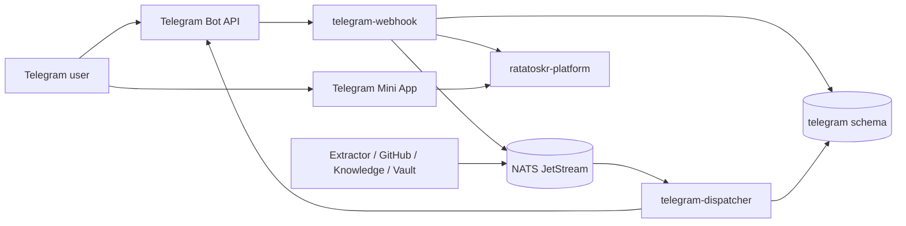
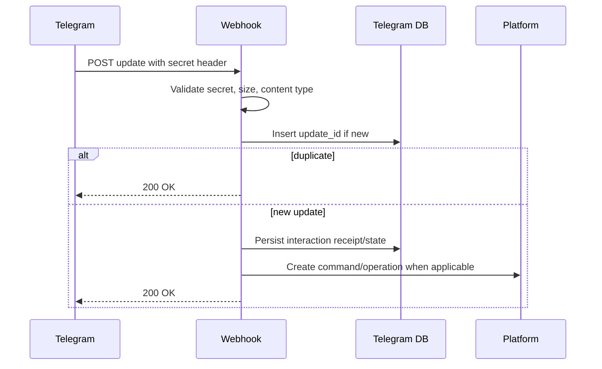
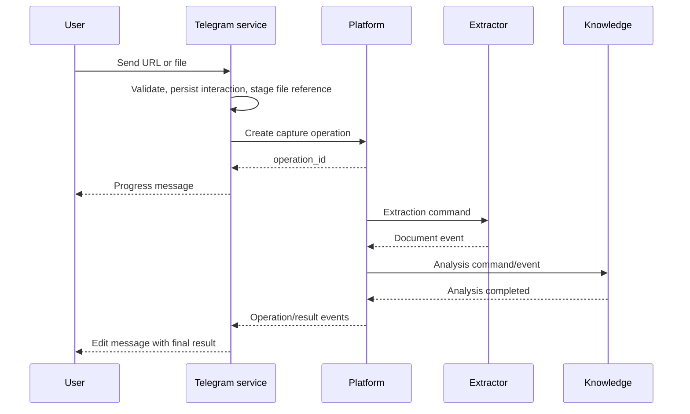
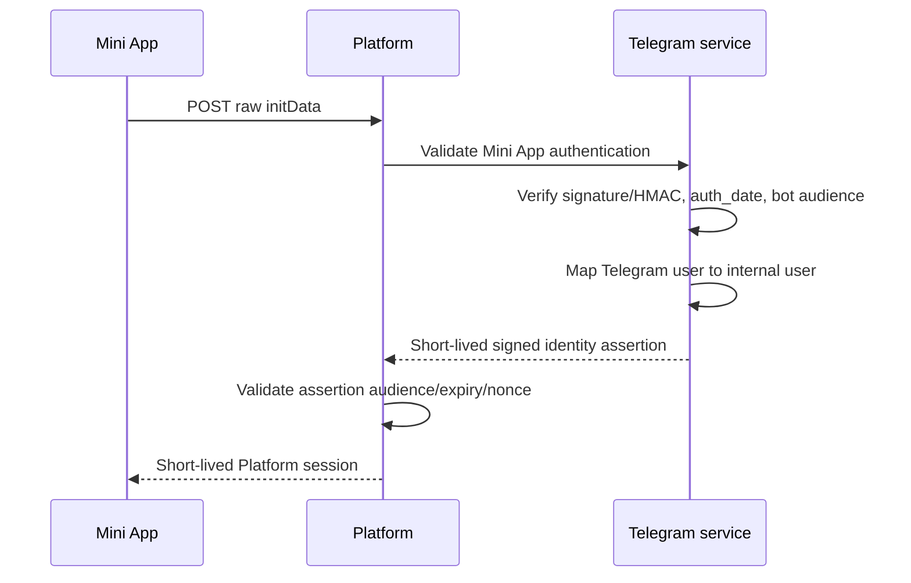

# Ratatoskr Telegram Architecture

> Status: target architecture. Plan items 1 through 8 are implemented, including secure durable
> intake, capture/GitHub flows, ordered delivery, generalized interaction tokens, versioned dialogue
> state, opaque `/start` intents, and bounded cleanup. Mini App authentication, notifications, and
> workspace integration remain planned.

## 1. Purpose

`ratatoskr-telegram` provides a Telegram bot and Telegram Mini App integration for Ratatoskr.

It enables users to:

- submit article URLs, forwarded messages, text, PDFs, and files;
- add GitHub repositories in `metadata`, `track`, or `star` mode;
- choose lists, backup options, collections, tags, and notes;
- view operation progress and terminal results;
- search or open archived content through a Mini App;
- receive configured notifications.

The service owns Telegram interaction and projection state. It does not own extracted documents, GitHub repository state, backups, summaries, embeddings, or provider credentials other than the Telegram bot credential.

## 2. Architectural position



The webhook path acknowledges Telegram quickly. Durable domain work continues asynchronously through Platform and the event bus.

## 3. Repository structure

```text
ratatoskr-telegram/
├── crates/
│   ├── telegram-domain/
│   ├── bot-api/
│   ├── webhook/
│   ├── dispatcher/
│   ├── identities/
│   ├── interactions/
│   ├── dialogues/
│   ├── callbacks/
│   ├── mini-app-auth/
│   ├── message-projections/
│   ├── notifications/
│   ├── platform-client/
│   ├── persistence/
│   ├── eventing/
│   ├── telemetry/
│   └── test-support/
├── services/
│   ├── webhook/
│   └── dispatcher/
├── schema.sql
├── fixtures/
├── tests/
└── docs/
```

The Mini App frontend can live in `ratatoskr-web` as a separate entrypoint. This repository owns backend validation and Telegram-specific contracts, not the React UI bundle.

## 4. Deployables

### 4.1. Webhook service

Responsibilities:

- receive Telegram Bot API updates;
- validate webhook secret and request limits;
- deserialize and validate supported update types;
- deduplicate `update_id`;
- map Telegram identity/chat to internal records;
- persist interaction receipt;
- enqueue durable processing or create Platform operations;
- return a successful HTTP response quickly.

It does not wait for extraction, GitHub API calls, backup, or LLM analysis.

### 4.2. Dispatcher service

Responsibilities:

- consume operation and domain events;
- resolve message bindings;
- render progress/result projections;
- send/edit/delete Telegram messages under policy;
- enforce per-chat/global ordering and rate limits;
- retry safe Bot API failures;
- persist outbound attempt/result state;
- send configured notifications.

Webhook and dispatcher may be runtime roles of one image, but use separate concurrency and permissions.

## 5. Bounded context and data ownership

Recommended schema:

```text
telegram.identities
telegram.chats
telegram.chat_memberships
telegram.updates
telegram.interactions
telegram.dialog_states
telegram.interaction_tokens
telegram.message_bindings
telegram.outbound_messages
telegram.outbound_attempts
telegram.notification_preferences
telegram.mini_app_assertions
telegram.outbox
telegram.inbox
```

Telegram stores interaction/projection state and references to Platform/domain objects. It does not copy complete article, repository, or analysis records.

## 6. Bot API boundary

The supported integration uses the official HTTP Bot API.

The service does not implement a hidden userbot or MTProto user-session connector. Reading personal dialogs, arbitrary channel history, or acting as a Telegram user would require a separate repository, consent model, credentials, and threat model.

Bot token rules:

- encrypted secret storage;
- token available only to webhook configuration, Mini App validation, and Bot API adapter;
- no token in Platform, Mini App frontend, events, logs, traces, or callbacks;
- rotation supported with controlled webhook reconfiguration;
- test bots/secrets isolated from production.

## 7. Webhook ingress

### 7.1. Request processing



### 7.2. Deduplication

Telegram may retry delivery. `update_id` is unique and persisted before side effects. Duplicate updates return success without repeating commands or Bot API writes.

Callback and Mini App actions also have independent one-time/idempotency tokens.

### 7.3. Fast acknowledgement

The webhook performs bounded validation and durable enqueue only. Its latency budget is independent from downstream operation duration.

Unsupported update types are recorded at a bounded metadata level and acknowledged according to policy without dumping private content into logs.

## 8. Telegram identity and access control

### 8.1. Identity mapping

```text
telegram_user_id -> telegram identity -> internal Ratatoskr user UUID
```

Telegram username/display name are mutable observations, not stable identity.

### 8.2. Binding

Binding may use:

- an owner-only bootstrap configuration for personal self-hosting;
- a one-time code approved in an existing Ratatoskr session;
- an invitation policy for additional users.

A received Telegram message does not create a fully authorized Ratatoskr user automatically.

### 8.3. Chats

The service distinguishes:

```text
private chat
group
supergroup
channel
```

Initial scope should default to authorized private chats. Group/channel behavior requires explicit policy, privacy review, bot permissions, and command semantics.

### 8.4. Authorization

Every command validates:

- bound internal user;
- allowed chat type and chat membership;
- command/action permission;
- target resource ownership;
- provider write consent where applicable.

Forwarded content does not transfer the original author's Ratatoskr authorization.

## 9. Update and interaction model

An interaction links:

- Telegram update/message/callback identifiers;
- internal user and chat;
- parsed intent;
- dialogue state;
- Platform operation ID;
- message bindings;
- timestamps and terminal result.

Interaction states:

```text
received
parsed
awaiting_input
awaiting_confirmation
submitted
tracking
completed
cancelled
expired
failed
```

Long-lived dialogue state is explicit and expires. It is not held in process memory.

## 10. Command architecture

Representative commands:

```text
/start
/help
/article <url>
/repository <url>
/search <query>
/status
/settings
/cancel
```

Bare supported URLs can route to article, GitHub, X, Instagram, or Threads handling.

Commands are parsed deterministically. Ambiguous input creates a confirmation/selection dialogue rather than guessing a destructive action.

## 11. Article and document flow

Supported input:

- URL in a message;
- `/article <url>`;
- forwarded channel/user message containing a URL;
- multiple URLs under configured limit;
- PDF/document attachment;
- explicit text note.



### 11.1. Telegram files

For a Telegram document:

- validate file metadata and size policy;
- retrieve through the Bot API file mechanism using the bot token inside Telegram service;
- stream into scoped Platform/Blob upload without loading the full file into memory;
- record Telegram file ID/unique ID and content hash where available;
- never expose Telegram file URLs/tokens to clients or events;
- treat file bytes and filename as hostile input.

Provider parsing remains in Extractor/archive services.

### 11.2. Forwarded messages

The archive records capture provenance:

```text
capture source = TelegramForward
forward metadata available to bot
captured text/URL
captured_at
```

Forward metadata is not assumed complete or trustworthy and does not bypass source-service resolution.

## 12. GitHub repository flow

Bare GitHub repository URLs open a safe preview/selection flow.

```text
metadata
track
star
```

### 12.1. Preview

Telegram posts a typed read-only preview request through Platform's authenticated `/v1/gh/repositories/preview` gateway and renders:

- repository name/description;
- exact available `metadata`, `track`, and `star` capabilities.

### 12.2. External write confirmation

Every action mode requires a second inline confirmation token describing:

- GitHub account;
- repository;
- external starring effect;
- catalog-only or desired-backup effect;
- provider-star effect when mode is `star`.

Callback payload contains an opaque token, not the full repository/policy JSON.

### 12.3. Partial success

Final projection reports outcomes separately:

```text
metadata added
GitHub star succeeded/failed/skipped
backup policy accepted/failed/skipped
```

Telegram never attempts compensating provider mutations itself.

## 13. Callback token architecture

Telegram callback data has size and trust limitations. Buttons carry an opaque one-time token.

A callback token stores server-side:

```text
token hash
internal user/chat binding
interaction ID
action type
validated payload reference
expiry
consumed_at
```

Processing rules:

- bind to expected user/chat/message;
- verify expiry and one-time state;
- consume transactionally with command creation;
- duplicate delivery returns the original result;
- never embed provider credentials, raw URLs, or sensitive settings in callback data.

## 14. Deep-link and interaction intents

The implemented Bot API operation-status link uses the shared opaque token registry:

```text
https://t.me/<bot>?start=<64-character-token>
```

The current closed deep-link action targets:

```text
operation status
```

Intent rules:

- bound to bot, Telegram user, chat, and expected action;
- expires;
- one-time consumption;
- payload stored server-side;
- exact `/start` grammar carries no business data;
- forwarded/stale links cannot expose another user's resource;
- raw URLs and policy JSON are not placed in the deep link.

Mini App `startapp` authentication remains item 9 and must bind its validated launch parameter to
server-side authority rather than treating this Bot API `/start` transport as a session.

## 15. Telegram Mini App architecture

The Mini App frontend is a client of Platform and shares components/contracts with `ratatoskr-web` where practical.

Possible frontend layout:

```text
ratatoskr-web/
├── apps/
│   ├── web/
│   └── telegram-mini-app/
└── packages/
    ├── api-client/
    ├── domain-ui/
    ├── design-system/
    └── telegram-bridge/
```

Telegram-specific frontend code handles launch parameters, theme/viewport integration, back button, and closing behavior. Domain data still comes from Platform APIs.

## 16. Mini App authentication

### 16.1. Trust boundary

Client-side `initDataUnsafe` is presentation input only. Raw `initData` must be validated server-side.

### 16.2. Flow



### 16.3. Validation

Telegram service validates:

- official signature/HMAC algorithm for the configured Mini App flow;
- exact raw data-check string;
- expected bot/application audience;
- `auth_date` freshness;
- required user fields;
- internal binding/access policy;
- replay nonce/one-time exchange where used.

Bot token never reaches Platform or frontend.

### 16.4. Platform session

The resulting session is short-lived, scoped, revocable, and subject to normal Platform authorization. Raw `initData` is not reused as a general bearer token.

## 17. Message projection architecture

A Telegram message is a projection of interaction/operation state, not the source of truth.

`message_bindings` map:

```text
interaction/operation ID
chat ID
message ID
projection type
last rendered revision
last successful send/edit
terminal state
```

Typical progress projection:

```text
Accepted
Fetching source
Extracting content
Analyzing
Completed
```

Progress text is truthful and stage-based. Percentages are used only when backed by meaningful bounded work.

## 18. Outbound dispatcher

### 18.1. Durable outbox

All sends/edits/deletes are represented as durable outbound records.

```text
planned
-> ready
-> sending
-> sent
```

Alternative states:

```text
retry_wait
superseded
failed_permanent
cancelled
```

A newer projection revision can supersede an unsent older edit.

### 18.2. Ordering

Operations are ordered per chat/message binding. The dispatcher prevents concurrent conflicting edits to one message.

### 18.3. Rate limits

The dispatcher enforces:

- global bot limits;
- per-chat limits;
- method-specific limits where relevant;
- `Retry-After`;
- jittered backoff;
- priority for direct command responses over background notifications.

### 18.4. Bot API error classification

Transient:

- throttling;
- network/server errors;
- temporary edit conflict.

Permanent/action-required:

- bot blocked;
- chat not found or membership lost;
- message cannot be edited/deleted;
- invalid markup/payload;
- user access revoked.

Permanent projection failure updates interaction state but does not roll back domain work.

## 19. Rendering and message safety

- use a controlled Markdown/HTML renderer for Telegram-supported syntax;
- escape all user/provider text;
- truncate/split messages under platform limits;
- preserve links through validated URLs;
- avoid sending secrets, private raw content, stack traces, or signed Blob URLs;
- include buttons only for authorized opaque actions;
- gracefully fall back from edit to new message when allowed;
- store rendered revision hashes to avoid duplicate edits.

## 20. Notifications

Notification categories may include:

- operation completion or partial failure;
- watched GitHub repository change;
- backup failure/restore issue;
- account reauthorization required;
- overdue ChatGPT/Claude export backup;
- digest or scheduled summary when explicitly enabled.

Preferences are per user/chat/category and include quiet hours, batching, and delivery target.

Domain services emit facts; Telegram decides whether/how to notify according to Telegram-owned preferences.

## 21. Platform interaction

Telegram uses Platform public/internal façade contracts rather than calling every domain service directly.

Representative operations:

```text
create capture
add GitHub repository
confirm external write
get operation status
search library
get item summary/detail projection
exchange Mini App identity assertion
```

Service-to-service identity and least-privilege authorization apply. Telegram cannot read arbitrary domain schemas.

## 22. Commands and events

### 22.1. Commands/events produced

Through Platform or the bus:

```text
content.capture.requested.v1
github.repository.add_requested.v1
platform.operation.cancel_requested.v1
telegram.notification.test_requested.v1
```

### 22.2. Events consumed

```text
platform.operation.progressed.v1
platform.operation.completed.v1
content.document.extracted.v1
knowledge.analysis.completed.v1
github.repository.added.v1
vault.snapshot.verified.v1
social.source.upserted.v1
github.account.reauth_required.v1
```

Telegram consumes bounded projection fields and references. It does not copy complete source data.

### 22.3. Events emitted

```text
telegram.identity.bound.v1
telegram.interaction.started.v1
telegram.interaction.completed.v1
telegram.delivery.failed.v1
telegram.mini_app.assertion_issued.v1
```

## 23. Persistence and transactions

Transactions group:

- update deduplication and interaction creation;
- callback token consumption and command creation;
- dialogue transition;
- message projection revision and outbound outbox insert;
- Mini App assertion nonce/use state;
- inbox/outbox deduplication.

Telegram and Platform/Bot API network calls occur outside transactions with durable intermediate states.

## 24. Dialogue architecture

Dialogues are finite state machines with explicit expected input.

Example repository flow:

```text
repository_url_received
-> preview_loading
-> choosing_mode
-> choosing_list
-> choosing_backup_policy
-> awaiting_confirmation
-> submitted
```

Each state defines:

- allowed next updates/actions;
- validation;
- expiry;
- cancel behavior;
- message projection;
- stored minimal payload references.

Unexpected input does not execute an action and may offer restart/cancel.

## 25. Failure model

### Transient

- Bot API or Platform timeout;
- Telegram rate limit;
- downstream operation delay;
- event-bus/database outage.

### Action-required

- user not bound/authorized;
- provider account or write consent missing;
- bot blocked or removed;
- Mini App auth stale;
- file too large or unsupported.

### Partial

- domain operation partly succeeded;
- progress message edit failed but work completed;
- notification delivery failed;
- one URL in a batch failed.

Interaction and delivery state remain distinct from domain operation state.

## 26. Security boundaries

- Bot API only; no hidden MTProto/userbot behavior.
- Bot token remains encrypted inside Telegram service.
- Webhook secret is validated before parsing/processing.
- Updates, callback data, deep links, files, text, and forwarded metadata are hostile input.
- `update_id`, callback tokens, and intents are deduplicated/replay-protected.
- Mini App raw `initData` is verified server-side and age-checked.
- `initDataUnsafe` and `web_app_data` are never trusted as authorization.
- Provider tokens never enter Telegram.
- External writes require explicit confirmation and owning-service validation.
- Bot messages escape untrusted text and do not expose private blobs/secrets.
- Group/channel use is disabled or explicitly authorized by policy.
- Logs and metrics exclude message text, file content, tokens, and private URLs.

## 27. Observability

Required telemetry:

```text
telegram_webhook_requests_total
telegram_webhook_latency_seconds
telegram_updates_total by coarse type
telegram_duplicate_updates_total
telegram_interactions_by_state
telegram_interaction_token_presentations_total
telegram_dialogue_transitions_total
telegram_interaction_cleanup_rows_total
telegram_mini_app_auth_results_total
telegram_outbound_queue_depth
telegram_bot_api_requests_total
telegram_bot_api_latency_seconds
telegram_rate_limit_retries_total
telegram_delivery_failures_total
telegram_operation_projection_lag_seconds
```

User/chat/message IDs are controlled trace fields, not unbounded metric labels.

## 28. Testing architecture

### Unit

- update parsing and routing;
- identity/access policies;
- dialogue state machines;
- callback token binding/expiry/one-time use;
- deep-link intent rules;
- Mini App validation vectors;
- message rendering/escaping/splitting;
- rate-limit and retry decisions;
- partial-result projection.

### Integration

- webhook secret and update deduplication;
- current-schema creation and SQLx transactions;
- fake Bot API send/edit failures and `Retry-After`;
- Platform command/idempotency flow;
- outbox/inbox replay;
- file streaming/upload;
- dispatcher restart and ordering.

### Security/adversarial

- replayed callback/update/initData;
- forged or stale Mini App payload;
- malicious Markdown/HTML and URLs;
- oversized message/file metadata;
- user/chat mismatch;
- forwarded content impersonation;
- group message without authorization;
- Bot API token/log leakage checks.

### Workspace end-to-end

- submit article URL and receive progress/result;
- upload PDF and complete extraction/analysis;
- add GitHub repository in all modes;
- `star` confirmation and partial result;
- launch Mini App through opaque intent and exchange session;
- restart webhook/dispatcher without duplicate side effects;
- deliver configured notification.

## 29. Deployment architecture

```text
telegram-webhook:
  public HTTPS webhook endpoint
  Telegram webhook secret
  telegram DB role for ingress/interactions
  Platform client credentials
  limited command publish permissions

telegram-dispatcher:
  no public endpoint except health
  Bot API token
  telegram DB role for outbound/projections
  operation/domain event subscriptions
```

Both require PostgreSQL and NATS JetStream. The Mini App static frontend is deployed with the web client and communicates with Platform over HTTPS.

Webhook setup/rotation is an explicit deployment operation. Readiness confirms database/event-bus availability and required secret configuration; it does not send test messages automatically.

## 30. Architectural invariants

1. Telegram owns interaction and projection state only.
2. Webhook handling is fast, durable, and idempotent.
3. `update_id` is deduplicated before side effects.
4. Long-running domain work is represented by Platform operations.
5. Webhook and outbound dispatcher have separate runtime responsibilities.
6. Bot token never leaves Telegram service.
7. Mini App authentication is validated server-side from raw `initData`.
8. Callback data and deep links contain opaque tokens, not sensitive payloads.
9. External provider writes require explicit confirmation.
10. Message projections are not domain source of truth.
11. Outbound delivery is durable, ordered, rate-limited, and retry-safe.
12. Telegram files/text/URLs are hostile input.
13. No hidden MTProto/userbot capability exists in this service.
14. Provider credentials and domain database tables remain outside the boundary.
15. Delivery is at-least-once and all handlers are idempotent.

## 31. Evolution

Initial milestones:

1. Bot token configuration, webhook secret validation, and update deduplication.
2. Identity binding and owner-only private-chat access.
3. Dispatcher outbox, message bindings, edit/retry/rate limits.
4. Article URL capture with Platform operation progress.
5. PDF/file streaming and forwarded-message handling.
6. GitHub repository preview and `metadata`/`track`/`star` flow.
7. Opaque callback/deep-link tokens, durable dialogue state, and bounded cleanup. (implemented)
8. Mini App raw `initData` validation and assertion exchange.
9. Notification preferences and selected domain notifications.
10. Security audit, operational runbooks, and optional multi-user/group policy.

Changes to Bot API versus MTProto scope, Mini App trust model, identity binding, external-write confirmation, or group access require ADRs and coordinated workspace changesets.
